### Lecture 1 : File Organization 
- Create table Customer (
																					First_name char(50),
																					Last_name char(50),
																					city char(50),
																					Birthdate char(50),
																					);
- this runs for O(n) if we are going to magnify the data to for example 1M.
- we use INDEX is data structure that they are built seperate of the table. 
- create index IDX_Customer_first_name on Custome (First_name);
   create index IDX_Customer_first_name on Custome (city);
- the search of `first_name` and `city`  will be al least O(1) or at most O(log n)
- to create an index --> `create index index-name on table-name(columns)`
- to drop an index --> `drop index index-name; `
- postgreSQL tables --> `select * from pg_index` :
	postgres stores these indicies in a table called `pg_index` and it will keep track of each index that has been deleted and which has been created. --> to see who did what and also used for maintainence.
- this will make things slow because the index takes a copy of the column you specified and it will be triggered when an insertion or deleltion occur either in the index content or in the table content. in other words,  if you want to insert X in the table you have to update it in the index table also.
- But mainly it speeds up the search operation (select) in table -->  O(log n) or  O(1).
##### Take Away 1
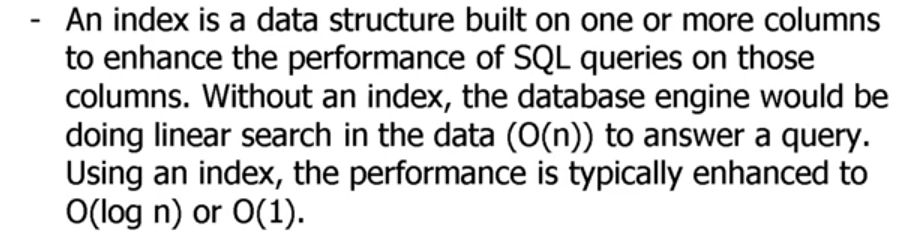

### RDBMS Architecture (_VIP_)
- __SQL__ :  4th generation language it's like prolog where you give him some instrustions and you don'e know what is happening back
- __Query Processor__ :  it will take the quries that should be executed in SQL and then it will tell you ___oh! there is syntax error here___  
- __Transaction Processor__ :  it will take the output from __Query Processor__ and then create a container (transaction) and pass it to __scheduler__.
- __RBL (ROZ B LABAN :D)__ (___Recovery, Buffer, and Log manager___)  : They are mainly concerned about data protection and consistency of the data 
- __Data Files__ : How data and indicies will be stored on disk. 
- __Log__ : saving history and changes of what's going on the database. (Historical Manager)

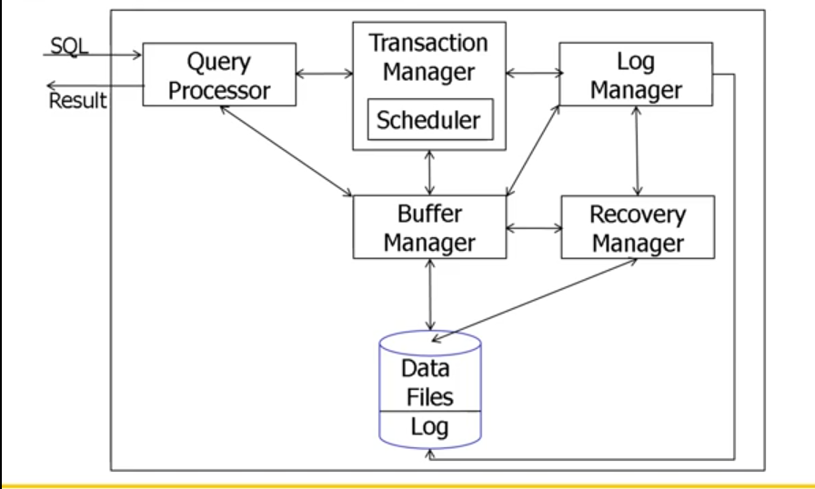

-  dividing the table into several chunks which are called page to reduce the size of the table 
- early databases were stored in paper tape , Magnetic tapes. 
- _Sqeuential File Access_ : start from the beggining and passing through all the data row by row untill I get the data I want. (Like LinkedList).
- what if I need to retrieve row number 10 where they are located on the tape ?
- ___Fixed Length Record___ : for every table you study all columns in the table and then you find the length of every column in terms of bytes. and then you want know the maximum size that you will ever need.
-> For example
we go for the 2nd column and see how much bytes do we need to store ? we say we have maximum number of letters observed are 20 and so on for all columns.
and then add all the sizes of all columns. this will give you width of row. This means that we will fix the size of every row.
Thus,  if the size of the row is 10 and I want to go row 500  **∴** we need to skip 499*10 bytes to go row 500.

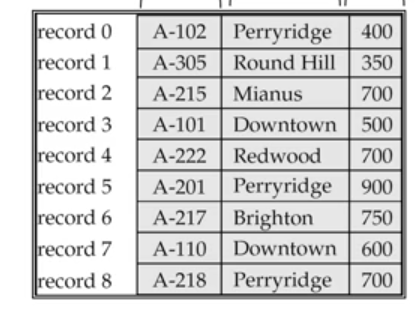

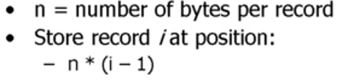

==> where N is the maximum width of a row.
- the problem here that is __wasting space__ ! there will be a space wasted and not needed for some records.
- insertion : append at the of the record
- deletion :  if we delete a row in somewhere at the middle it will create an empty space so we have to shift from bottom to top ! (__DEFRAG__)

- __Variable Length Record__ : stores the record for the space it needs. it's like row insertion side by side and separting them by a special character. but the problem here is that you have to look for the special characters back and forth. so the solution is to store pointers at the begining of the page that points to the address of each row.
- The page grows from right to left.
- the nice thing here is that the record may move and float inside the page  but it's oblilvious to the world outside.

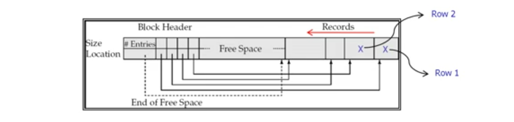
 
#### Sorted Sequential File Organization ==> (we could use Binary Search right there !!)
- Insertion : it will be easy but what if the insertion is in the middle of the table, we have to shift all rows down to make an empty space for the new entry.
- Deletion : DEFRAGMENTATION
-  The search here is fast but deletion and Insertion are very slow

#### Indexed File Organization
- __Search Key__ : Attributes or set of Attributes used to look up records.

### Primary Keys : 
__if you build an index on a particular column. this is called primary index because it's sorted depending on this index__
- __Primary Dense :__
	- it holds at least 1 instance of a key appearing in the column
	- in other words any distinct different index that appeared should be __Primary dense index__.
	- The search will be really fast but it would fail in some cases (where the index doesn't exist.
	- Insertion will be also easy because the search is easy as well. but what if we have a new index to be inserted. Then we know that the primary dense indicies are sorted so it's easy to search for its place using Binary search for example.
	- Deletion  : You will use also the index so search .
	
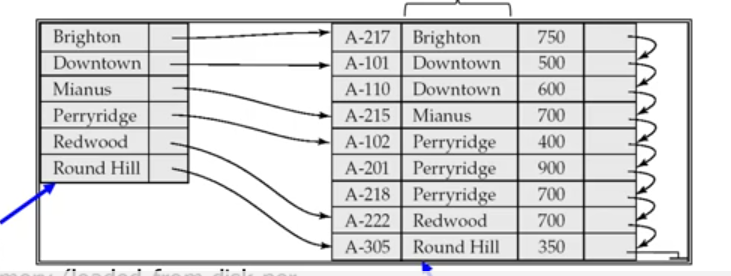

- __Primary Sparse Index__:
	- it is the same as Primary dense but we will not include all the instances from every value in the column. so we pick some indicies in systematic way _for Example : (we pick 1 index every 10 rows)_. 
	- it's better to use in the sake of fitting the indexes in the memory
	- but the disadvantage here that we will search linearly between 2 particular indicies if the recorde is not present.
	- USE THIS WHEN the table is huge in size in low memory size.
	
	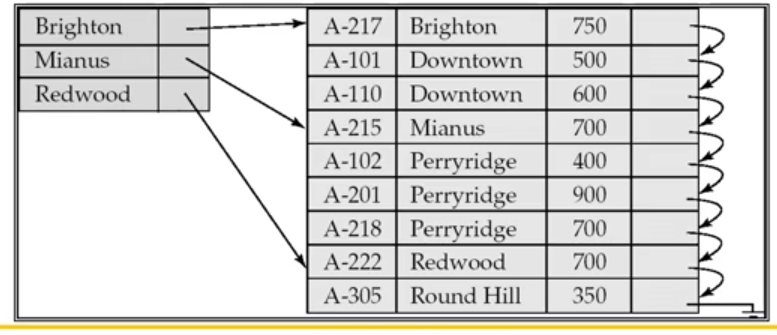
- __Second Level Sparse Index on Primary Field__ (like trees !)
	- Mix between dense and sparse index
	- it's used when the no enough memory to load all of the primary index
	- points to ___primary dense index___.
	
	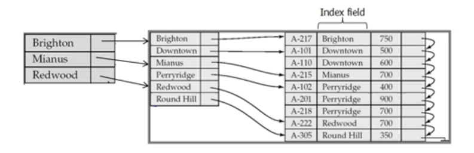

##### Take Away 2

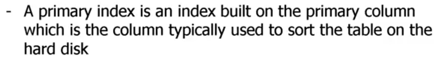

##### Take Away 3

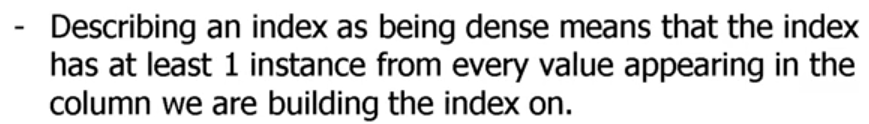

##### Take Away 4

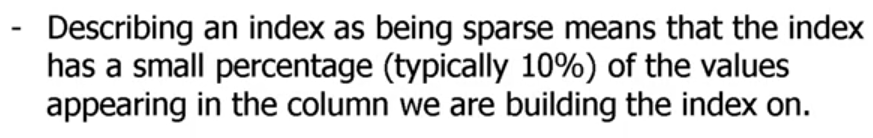
### Secondary Keys : 
-  it's the same as primary index but it's not used to sort rows. _Think about TV types we search on it by their name not by the productID_
- to create secondary key the table should be sorted according to the primary key 
  meaning Secondary key must be __DENSE__.
- if column used in secondary index is not UNIQUE, point to a list which points to the relevant tuples.

### Secondary level Secondary Index :
- it is a sparse one which must point to a dense Secondary index of same column

##### Take Away 5

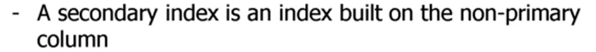
##### Take Away 6

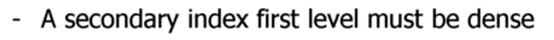
____
##### sparse VS Dense Tradeoff
- __Sparse__  : Less index space per record but you go into the table more.
- __Dense__  : Can tell if any record exists without accessing relation file but it takes more memory.

- Note : Dense is referring to data record directly while sparse indexing is referring to __Blocks__ containg data record. 

- if you are using Primary dense key and there are duplicate keys. So we have to include all keys but there is a problem where it will consume more memory.

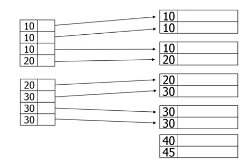

- what if we point the very first occurence of the duplicate value ? 
	  there is a problem here which is that we've forgetten about the duplicates. where the duplicates are being spammed in alot of pages so we will lose them. 
	  
	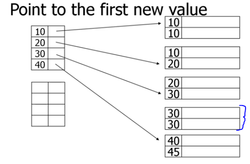
- To fix this, we have to pick a value from every page.

- Here we have to find out the number the page before the index to ensure that is not included in the previous page (where this page is pointed by another index with different value).

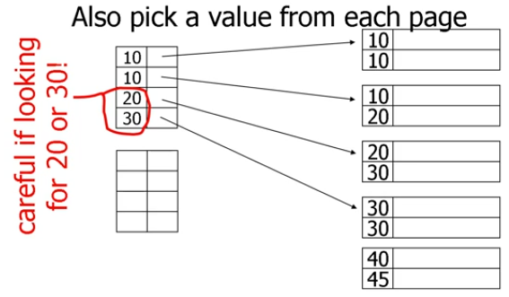

- __See temporary overflow page__ !

#### Block-Range Index (__BRIN__)
- store the smallest and largest value that appears in every page
- it should have a pointer pointing to a particular page.

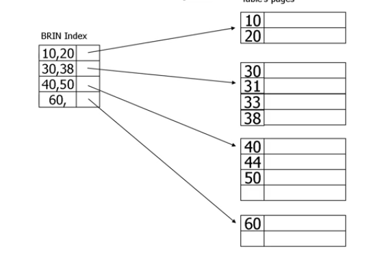

- we could have Multi-level BRIN index

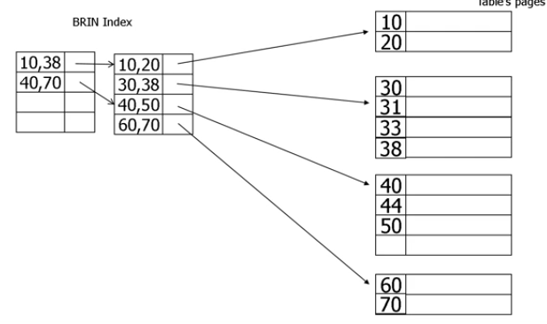

- When to Use BRIN Index ?
  - when you are trying to run some quries which belongs to small range in huga table that has much wider range (___Low-Selectivity queries___)
  -  if you are doing analytical queries such as aggregates, sums, averages, so on.
- __To create BRIN Index in PostgreSQL -->__ `Create Index Index-Name ON Table-Name(Columns..) USING BRIN;`
##### Take Away 9
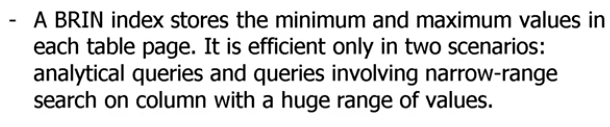