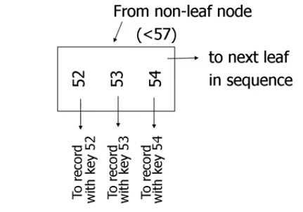
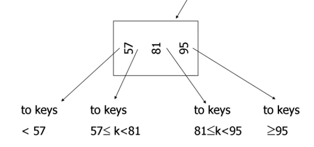
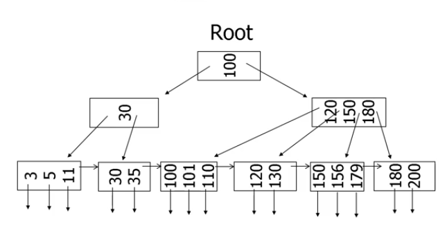
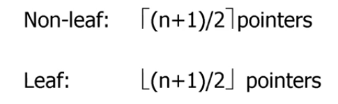
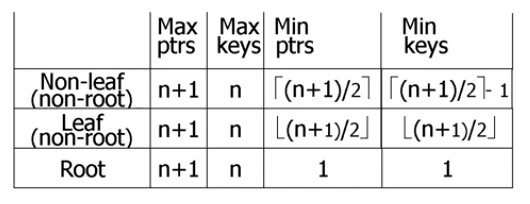
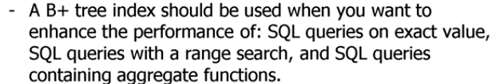

# Lecture 2 : B+ Trees and R Trees
- __B+ Trees__ : It's a tree that has root and going down to some leaves 
- it's a secondary storage data structure ___That is partially stored in disk and the other part is on the memory .___
- All nodes except the root are saved on a hard-disk
- __Self-balanced data strusture__ --> which means that it's being searched in ___O(Log n)___.
- we have some rules we should obey :
  - all leaves are at the same lowest level
  - pointers in leaves point to records except for __"Sequence pointer"__.
  

- the leaf node will consist of number of values. each of these values is associated with a reference pointing to a particular row in the page. 
- _for example value 52 has an arrow below it which is referring to a row which has a column (index) of value 52_
-  notice here that there is a neighbour refernce pointing to the next leaf. 

- NON-Leaf 

- this is not __Binary Search tree__ as it has more than 2 children.
- note the if you have 3 values we will have 4 pointers :
  so there is a formula to that which is  ___n = m +1___ where ___m___ is the number of values in one page and ___m___ is the number of pointers.

- For example :

- note that in the image above we have ___n = 3___ which tells you the maximum number of key you could have in a node. __Also__ note that we have the last row of leaves the values were sorted from left to right.

### Important NOTE !!!! The minimum of node we could have if it is 

- where ___n___ here is the number of values in a node
- we do ceiling up in the non-leaf because it does branching but in the leaf we don't want more pointers that's why we do flooring down.

this next image sums up all the formulas:

- note in the previous table when you are trying to calculate for example ___Min ptrs___, the ___n___ there refers to the number of keys and in the ___Min Keys___, the ___n___ refers to number of pointers
- Insertion / deletion algorithm gurantee that the tree is always balanced.

-  See insertion and deletion techniques in lectrure slides.

#### When to use a B+ Tree Index ?
- Support queries on exact values or involving range search (i.e we want to see the values between 15 and 50)
- support aggregate functions

#### TakeAway 10

- To create an index using B+ Tree in PostgreSQL --> `create index index-name on table-name (column) using B_tree;`
- 